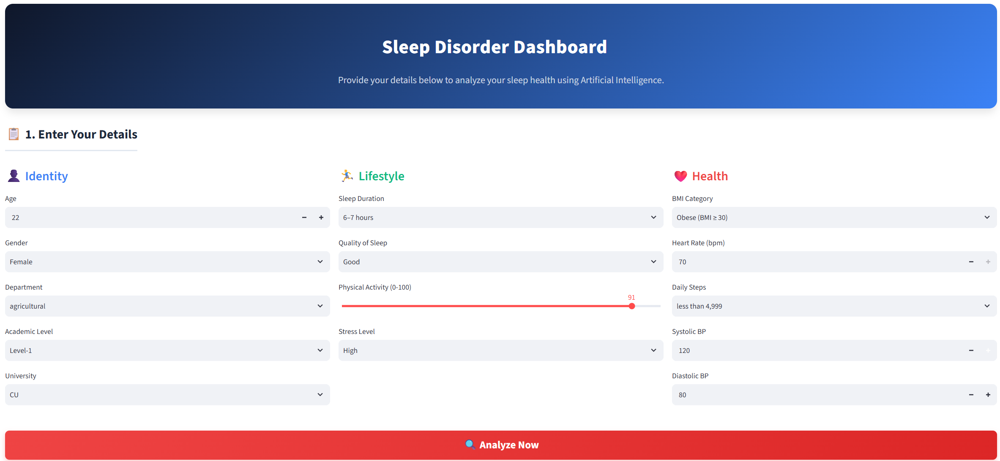
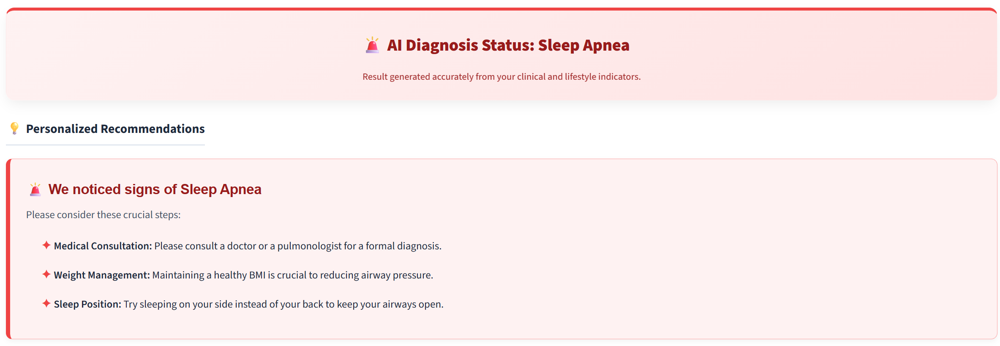
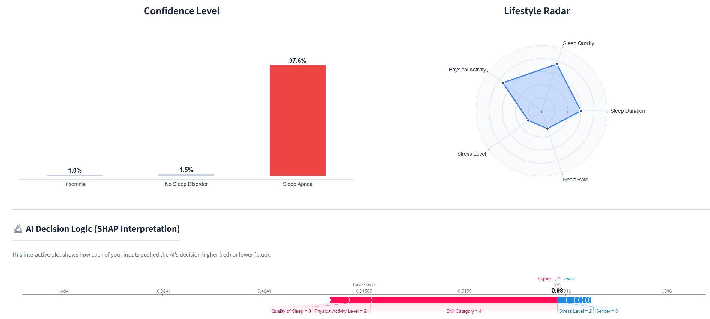

# 💤  Sleep Disorder Prediction System

An AI-powered web application built with Python, Streamlit, and Machine Learning to predict sleep disorders (Insomnia, Sleep Apnea, or No Sleep Disorder) and explain the predictions using SHAP interpretability.

---

## 📱 App Screenshots

### 1. User Input Dashboard
> Fill in your identity, lifestyle, and health details to evaluate your sleep profile.
 

  

### 2. Diagnosis Status & Visualizations
> Instant AI diagnosis status accompanied by a Confidence Level probability chart and a Lifestyle Radar chart.
 

  

### 3. AI Interpretability & Recommendations
> Actionable personalized recommendations and SHAP feature contribution analysis.
 

  

---

## 🚀 Live Demo
You can access the live application here: [https://sleepdisorder01.streamlit.app/]
